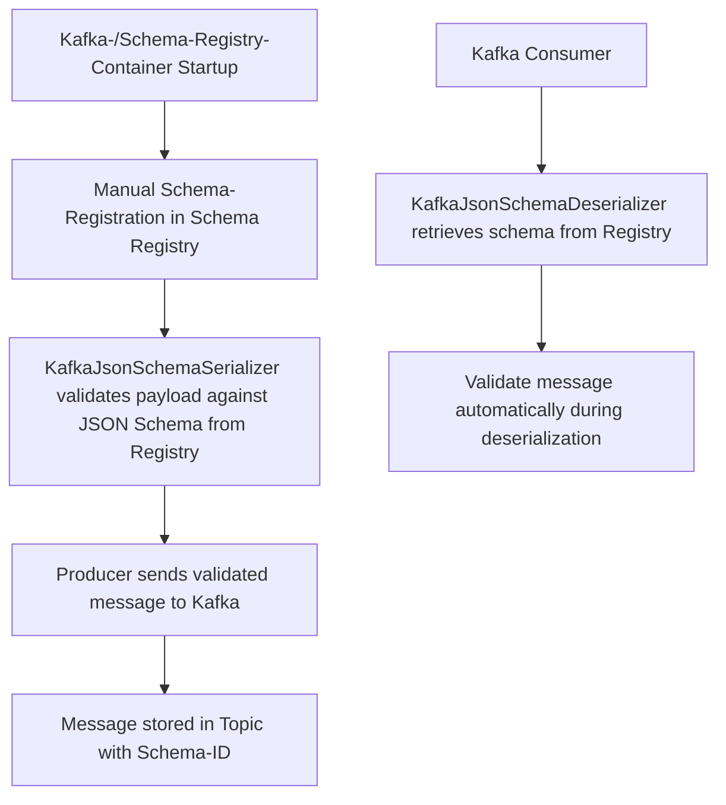

# Kafka Schema Registry PoC

Dieses Proof-of-Concept demonstriert, wie man eine Spring Boot Applikation erstellt, die Kafka-Nachrichten produziert
und konsumiert, wobei die **Confluent-Schema-Registry** zur **Schema-Validierung** genutzt wird.  

Die Applikation verwendet die **Confluent KafkaJsonSchemaSerializer/Deserializer**, um Nachrichten **automatisch gegen
JSON Schemas zu validieren**, die in der Schema Registry verwaltet werden.

## Features

- **Kafka Integration:**  
Nachrichten werden in Kafka-Topics produziert und konsumiert.

- **Schema Validation über Confluent Serializer/Deserializer:** 

  Die Serialisierung und Deserialisierung übernimmt automatisch die Schema-Validierung gegen die Confluent Schema Registry.
  Eine separate, manuelle Validierung ist **nicht notwendig**.

- **Dynamische Schema Registry:**  
  Die Applikation holt das Schema **zur Laufzeit** automatisch aus der Schema Registry.

- **Testcontainers:**  
  Kafka- und Schema Registry-Container werden für Integrationstests automatisch bereitgestellt.

- **Kafka Admin:**  
  Erstellung von Topics über den Kafka-AdminClient im Setup.

## Architektur

- **Spring Boot Applikation mit Spring Kafka**  
  Die Applikation nutzt Spring Kafka und die Confluent SerDes:
  - **Producer** verwendet `KafkaJsonSchemaSerializer`
  - **Consumer** verwendet `KafkaJsonSchemaDeserializer`  
    Diese Komponenten holen automatisch die richtigen Schemas aus der Registry und validieren Nachrichten bei der (De-)Serialisierung.

- **Schema Registry**  
  Die Schemas werden **extern verwaltet** und in der Registry gepflegt.  
  Die Applikation registriert **keine eigenen Schemas** automatisch (`auto.register.schemas=false`).

- **Test Base**  
  Gemeinsame Testbasis, die Kafka- und Schema Registry-Container startet, Properties dynamisch setzt, Topics erstellt und Test-Schemas registriert.

## Funktionsweise

### Produzieren von Nachrichten
- Nachrichten werden von der Spring Kafka `KafkaTemplate` produziert.
- Der `KafkaJsonSchemaSerializer`:
  - Holt das JSON Schema aus der Registry.
  - Validiert den Payload **vor dem Senden**.
  - Fügt die **Schema-ID** in die Nachricht ein.

### Konsumieren von Nachrichten
- Der `KafkaJsonSchemaDeserializer`:
  - Holt das korrekte JSON Schema anhand der **Schema-ID** aus der Registry.
  - Validiert die Nachricht beim **Deserialisieren** automatisch.
  - Gibt wahlweise `JsonNode` oder ein spezifisches DTO (`specific.json.reader=true`) zurück.

## Integrationstests

Die Integrationstests nutzen **Testcontainers**, um Kafka und die Schema Registry in Docker-Containern zu starten.  
Tests prüfen u. a.:
- Ob Nachrichten VOR der Publizierung gegen ein Schema validiert werden
- Ob Nachrichten bei dem Konsumieren gegen ein Schema validiert werden
- Ob das Schema korrekt in der Registry registriert wurde.
- Ob Nachrichten erfolgreich produziert und konsumiert werden können.
- Ob Schema-Kompatibilität gewährleistet ist.

## IT speziell für die Schema Registry Integration

- Die `SchemaRegistryIntegrationTest`-Klasse prüft:
  - Ob ein Subject in der Registry existiert.
  - Ob das neueste Schema korrekt geladen wird.
  - Ob neue Schemas kompatibel sind.
  - Ob neue Versionen manuell registriert werden können.

## Wichtigste Änderungen zu vorher

- Die Schema-Validierung findet **vollautomatisch** durch die Confluent SerDes statt.
- Kein manuelles Abrufen oder Validieren von Schemas im Code.
- Fokus auf saubere Trennung von **Schema-Verwaltung (Registry)** und **Nachrichtenverarbeitung (Kafka Clients)**.
