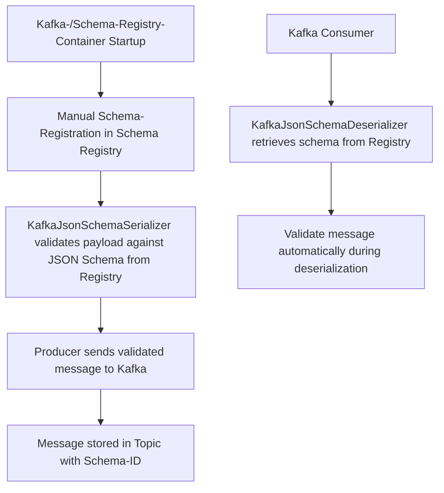

# Kafka Schema Registry PoC

Dieses Proof-of-Concept demonstriert, wie man eine Spring Boot Applikation erstellt, die Kafka-Nachrichten produziert
und konsumiert, wobei die **Confluent-Schema-Registry** zur **Schema-Validierung** genutzt wird.  

Die Applikation verwendet die **Confluent KafkaJsonSchemaSerializer/Deserializer**, um Nachrichten **automatisch gegen
JSON Schemas zu validieren**, die in der Schema Registry verwaltet werden.



## Features

- **Kafka Integration:**  
Nachrichten werden in Kafka-Topics produziert und konsumiert.


- **Schema Validation über Confluent Serializer/Deserializer:** 

  Die Serialisierung und Deserialisierung übernimmt automatisch die Schema-Validierung gegen die Confluent Schema Registry.
  Eine separate, manuelle Validierung ist **nicht notwendig**.


- **Dynamische Schema Registry:**  
  Die Applikation holt das Schema **zur Laufzeit** automatisch aus der Schema Registry.


- **Testcontainers:**  
  Kafka- und Schema Registry-Container werden für Integrationstests automatisch bereitgestellt.


- **Kafka Admin:**  
  Erstellung von Topics über den Kafka-AdminClient im Setup.

## Architektur

- **Spring Boot Applikation mit Spring Kafka**
  Die Applikation nutzt Spring Kafka und die Confluent SerDes (siehe `KafkaConfig.java:26`):
  - **Producer** verwendet `KafkaJsonSchemaSerializer` (konfiguriert in `KafkaConfig.java:52`)
  - **Consumer** verwendet `KafkaJsonSchemaDeserializer` (konfiguriert in `KafkaConfig.java:92`)
    Diese Komponenten holen automatisch die richtigen Schemas aus der Registry und validieren Nachrichten bei der (De-)Serialisierung.


- **Schema Registry**
  Die Schemas werden **extern verwaltet** und in der Registry gepflegt.
  Die Applikation registriert **keine eigenen Schemas** automatisch (`auto.register.schemas=false` in `KafkaConfig.java:55`).

  **Wichtig:** Schemas müssen vor dem ersten Senden manuell in der Registry registriert werden. In Tests übernimmt dies `TestBase.java:102`.


- **Test Base**
  Gemeinsame Testbasis (`TestBase.java`), die Kafka- und Schema Registry-Container startet, Properties dynamisch setzt, Topics erstellt und Test-Schemas registriert.

## Funktionsweise

### Produzieren von Nachrichten
- Nachrichten werden von der Spring Kafka `KafkaTemplate` produziert (siehe `KafkaConsumerIntegrationTest.java:37`).
- Der `KafkaJsonSchemaSerializer`:
  - Holt das JSON Schema aus der Registry.
  - Validiert den Payload **vor dem Senden**.
  - Fügt die **Schema-ID** in die Nachricht ein.

### Konsumieren von Nachrichten
- Der `KafkaJsonSchemaDeserializer`:
  - Holt das korrekte JSON Schema anhand der **Schema-ID** aus der Registry.
  - Validiert die Nachricht beim **Deserialisieren** automatisch (siehe `KafkaConsumerService.java:24`).
  - Gibt wahlweise `JsonNode` oder ein spezifisches DTO (`specific.json.reader=true`) zurück.
  - Bei Validierungsfehlern wird der `SchemaValidationErrorHandler` aufgerufen (`SchemaValidationErrorHandler.java:18`).

## Wichtige Implementierungsdetails

### Subject-Naming mit RecordNameStrategy

Die Applikation verwendet die **RecordNameStrategy** (`KafkaConfig.java:64`), um Subjects in der Schema Registry zu bestimmen:

```java
configProps.put("value.subject.name.strategy", RecordNameStrategy.class);
```

Diese Strategie nutzt das `title`-Feld aus dem JSON Schema als Subject-Namen.

**Entscheidend:** Die `@JsonSchemaTitle` Annotation im DTO (`MyKafkaMessage.java:9`) bestimmt den Subject-Namen:

```java
@JsonSchemaTitle("de.jwiegmann.registry.poc.control.dto.MyKafkaMessage")
public class MyKafkaMessage { ... }
```

**Warum ist das notwendig?**

Der `KafkaJsonSchemaSerializer` generiert zur Laufzeit ein JSON Schema aus dem DTO, um den Subject-Namen zu ermitteln:
1. Ohne `@JsonSchemaTitle`: Schema-Title = "My Kafka Message" → Subject nicht gefunden ❌
2. Mit `@JsonSchemaTitle`: Schema-Title = "de.jwiegmann.registry.poc.control.dto.MyKafkaMessage" → Subject gefunden ✅

Der Subject-Name **muss exakt** mit dem in der Registry registrierten Subject übereinstimmen (siehe `TestBase.java:48`).

### Warum auto.register.schemas=false?

Die Konfiguration `auto.register.schemas=false` (`KafkaConfig.java:55`) verhindert, dass Producer automatisch neue Schemas in der Registry registrieren.

**Vorteile:**
- Explizite Kontrolle über Schema-Änderungen
- Verhindert versehentliche Schema-Registrierungen
- Schemas werden zentral verwaltet und versioniert

**In Kombination mit:**
- `use.latest.version=true` (`KafkaConfig.java:58`) → Nutzt immer die neueste Schema-Version
- `latest.compatibility.strict=false` (`KafkaConfig.java:61`) → Keine clientseitige Kompatibilitätsprüfung

### Schema-Validierung im Detail

**Producer-seitig:**
- Schema wird aus DTO generiert (für Subject-Lookup)
- Neueste Schema-Version wird aus Registry geholt (`use.latest.version=true`)
- Payload wird gegen Registry-Schema validiert
- Bei Validierungsfehler: `SerializationException`

**Consumer-seitig:**
- Schema-ID wird aus Kafka-Message gelesen
- Schema wird aus Registry geholt (mit Caching)
- Payload wird gegen Schema validiert
- Bei Validierungsfehler: `SchemaValidationErrorHandler` gibt `null` zurück → Nachricht wird übersprungen (`SchemaValidationErrorHandler.java:39`)

## Integrationstests

Die Integrationstests nutzen **Testcontainers** (`TestBase.java:37`), um Kafka und die Schema Registry in Docker-Containern zu starten.

**Testcontainer-Setup:**
- Kafka-Container: Confluent Platform 7.9.0 (`TestBase.java:56`)
- Schema Registry-Container: Custom Implementation (`SchemaRegistryContainer.java:10`)
- Automatische Schema-Registrierung beim Start (`TestBase.java:92`)
- Test-Schema liegt in `src/test/resources/schema.json`

**Verfügbare Tests:**

### KafkaConsumerIntegrationTest
Prüft die End-to-End Integration (`KafkaConsumerIntegrationTest.java`):
- Gültige Nachrichten werden erfolgreich produziert und konsumiert (`testValidMessage()` Zeile 34)
- Ungültige Nachrichten (z.B. `version: -1`) werden vom Consumer abgelehnt (`testInvalidMessage()` Zeile 45)

### SchemaRegistryIntegrationTest
Prüft die Schema Registry Integration (`SchemaRegistryIntegrationTest.java`):
- Subject existiert in der Registry (`shouldContainExpectedSubject()` Zeile 59)
- Neueste Schema-Version kann geladen werden (`shouldFetchLatestSchemaAndCheckTitle()` Zeile 73)
- Schema-Kompatibilität kann geprüft werden (`shouldValidateSchemaCompatibility()` Zeile 99)
- Neue Schema-Versionen können manuell registriert werden (`shouldRegisterNewVersionManually()` Zeile 131)

### Kompatibilitätstests
- `SchemaRegistryBackwardCompatibilityTest`: Prüft BACKWARD-Kompatibilität (optionale Felder hinzufügen)
- `SchemaRegistryForwardCompatibilityTest`: Prüft FORWARD-Kompatibilität (optionale Felder entfernen)
- Basis-Klasse: `SchemaRegistryCompatibilityTestBase.java` mit Template-Methoden-Pattern

## Wichtigste Änderungen zu vorher

- Die Schema-Validierung findet **vollautomatisch** durch die Confluent SerDes statt.
- Kein manuelles Abrufen oder Validieren von Schemas im Code.
- Fokus auf saubere Trennung von **Schema-Verwaltung (Registry)** und **Nachrichtenverarbeitung (Kafka Clients)**.
